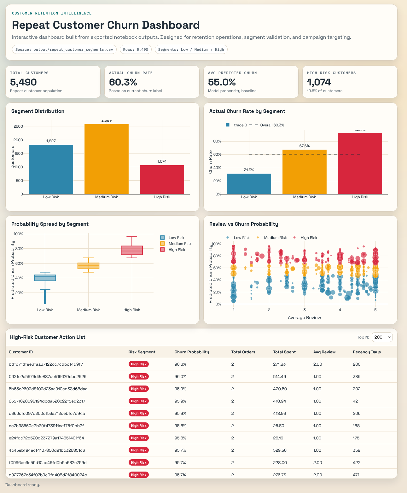
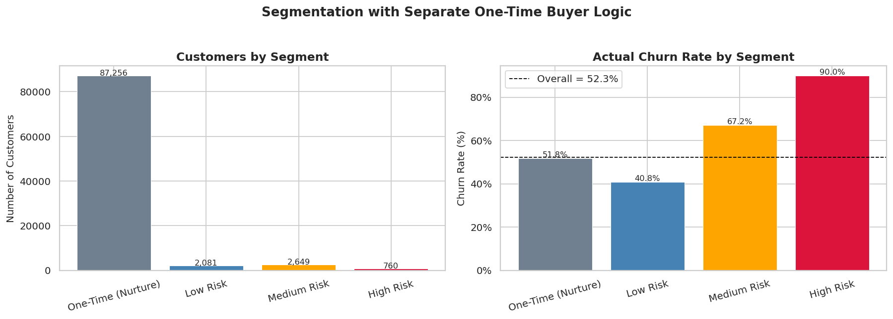
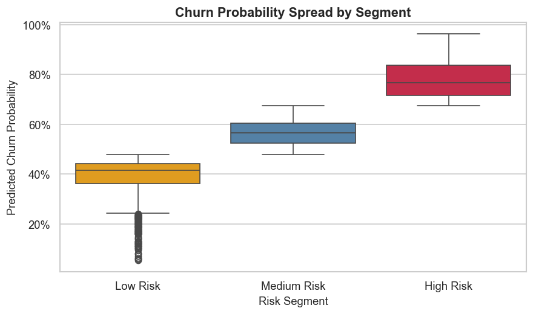
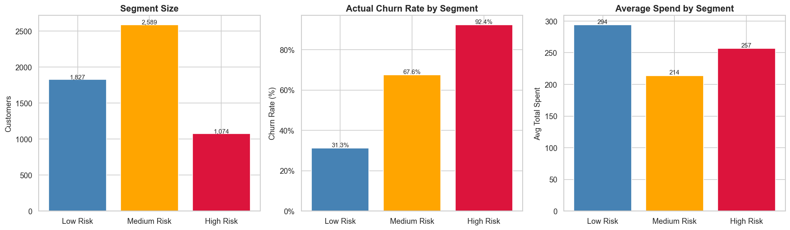
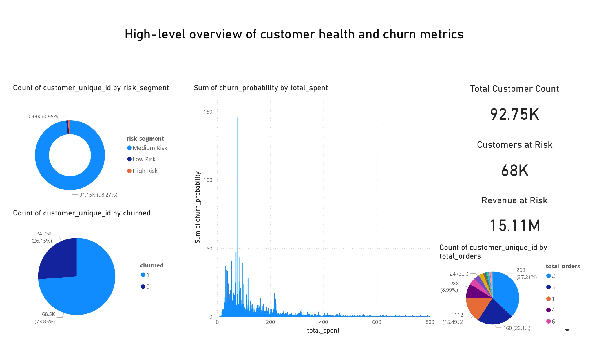
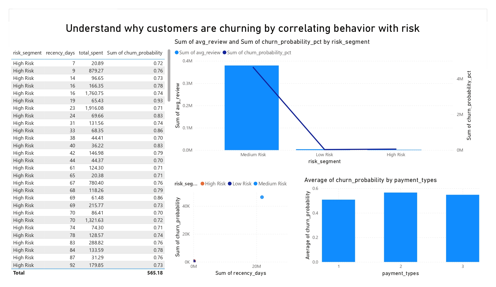
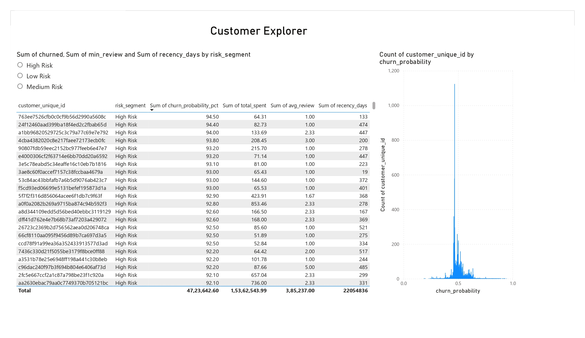

# Customer Churn Prediction and Retention Analysis

## Project summary
This project analyzes e-commerce customer behavior and builds a churn-risk workflow for retention targeting.  
The final solution separates one-time and repeat customers, trains a churn model for repeat customers, and produces segment-level outputs for dashboarding.

## Problem statement
Traditional dashboards show churn only as a historical KPI. This project extends that by:
- scoring churn propensity at customer level,
- creating risk segments,
- and generating action-oriented outputs for retention.

## Dataset
Source: Olist e-commerce dataset

Main files used from `data/`:
- `olist_customers_dataset.csv`
- `olist_orders_dataset.csv`
- `olist_order_payments_dataset.csv`
- `olist_order_reviews_dataset.csv`

## Workflow and process
### 1. Data preparation
- Joined customers, orders, payments, and reviews.
- Kept delivered orders only.
- Cleaned missing values and parsed datetime columns.

### 2. Customer-level feature engineering
- Built one row per customer with behavior features:
  - `recency_days`, `total_orders`, `total_spent`, `avg_review`, `min_review`, `pct_low_review`, `avg_payment`, `payment_types`.

### 3. Customer type split
- Added buyer-type classification:
  - `One-Time` (1 order)
  - `Repeat` (>1 orders)
- Applied separate churn horizon logic:
  - One-Time: churn if `recency_days > 210`
  - Repeat: churn if `recency_days > 180`

### 4. Repeat-customer modeling
- Trained `RandomForestClassifier` on repeat customers only.
- Used SMOTE to reduce class imbalance during training.
- Generated churn probability for each repeat customer.

### 5. Segmentation
- Scaled churn probabilities using `StandardScaler`.
- Applied KMeans (`n_clusters=3`) to create:
  - Low Risk
  - Medium Risk
  - High Risk

### 6. Outputs and dashboarding
- Exported repeat and one-time datasets separately.
- Exported segmented repeat-customer output for BI dashboards.
- Built both Power BI blueprint and standalone HTML dashboard.

## Final outcomes
### Customer split (latest run)
- Total customers: `92,746`
- One-Time customers: `87,256`
- Repeat customers: `5,490`

### Churn baseline
- Overall churn (new label logic): `52.3%`
- Repeat-customer churn baseline: `60.3%`

### Repeat segment results
- Low Risk: `1,827` customers, `31.3%` churn
- Medium Risk: `2,589` customers, `67.6%` churn
- High Risk: `1,074` customers, `92.4%` churn

### Model snapshot (repeat customers)
- Accuracy: `0.54`
- ROC-AUC: `0.518`

## Visual outputs

### Notebook visual placeholders

## PowerBI Dashboards

## Deliverables
- `eda_and_customer_split.ipynb`: EDA + one-time/repeat split + CSV export.
- `repeat_customers_modeling.ipynb`: Repeat-only model, diagnostics, and segmentation.
- `dashboard.html`: Interactive web dashboard.
- `POWERBI_DASHBOARD_BLUEPRINT.md`: Page plan and DAX measures for Power BI.

Generated outputs:
- `output/one_time_customers.csv`
- `output/repeat_customers.csv`
- `output/repeat_customer_segments.csv`

## How to run
1. Run `eda_and_customer_split.ipynb`.
2. Run `repeat_customers_modeling.ipynb`.
3. Optional HTML dashboard:
  - Start local server: `python -m http.server 8000`
  - Open: `http://localhost:8000/dashboard.html`

## Reflection document
Personal learnings, challenges, and improvement notes are moved to:
- `LEARNINGS_AND_CHALLENGES.md`
